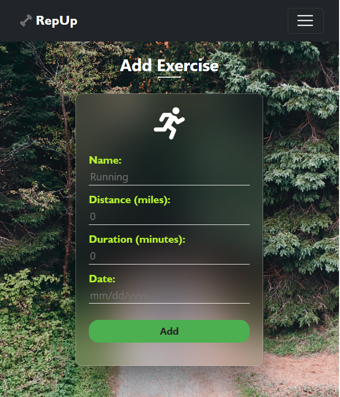
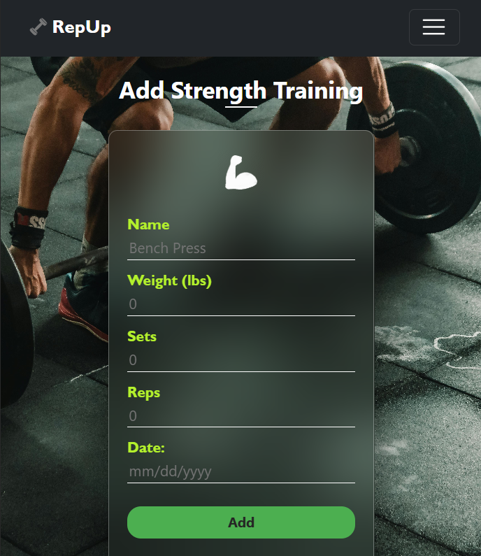
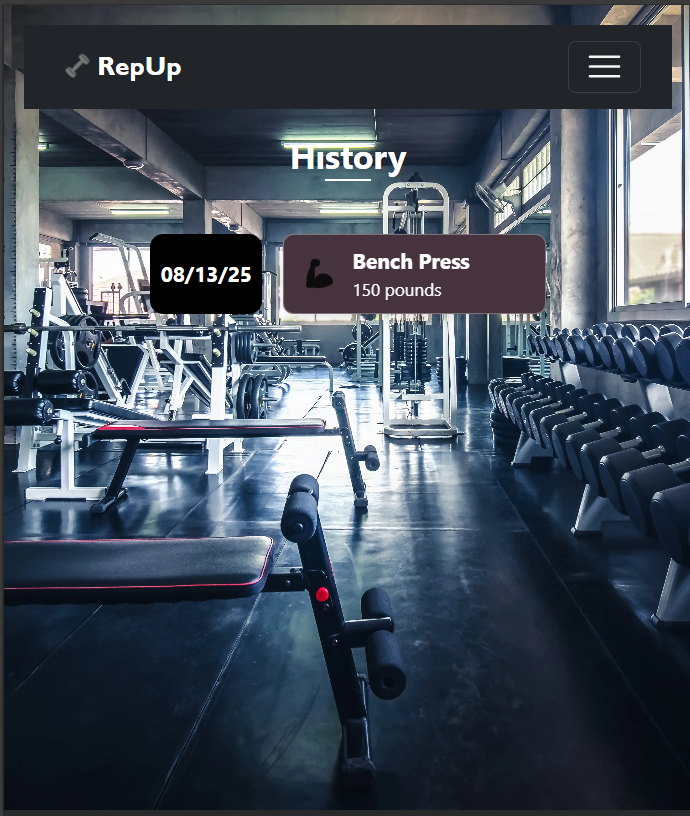

# RepUp

A MERN-stack fitness tracker application.

## Table of Contents

- [Description](#description)
- [Features](#features)
- [Technologies](#technologies)
- [Installation](#installation)
- [Usage](#usage)
- [License](#license)
- [Contributions](#contributions)
- [Questions](#questions)

## Description

FitTrack is a user-friendly MERN-stack application designed to help individuals effortlessly track and manage their daily fitness routines. Whether you're logging cardio sessions, resistance training, or strength workouts, this app provides an intuitive interface to monitor progress, view historical data, and maintain motivation on your fitness journey.

## Features

- **Exercise Logging**: Easily add and track cardio, resistance, and strength training exercises.
- **Workout History**: View detailed records of past workouts, including options to filter by type.
- **Exercise Management**: Delete unwanted exercises from your logs.
- **User Authentication**: Secure login and registration powered by JWT for personalized tracking.
- **Responsive Design**: Works seamlessly on desktop and mobile devices.

## Technologies

This project is built using the following technologies:

- MongoDB (with Mongoose for schema modeling)
- Express.js (for server-side routing and API handling)
- React.js (for dynamic frontend user interface)
- Node.js (for runtime environment)
- JWT (JSON Web Tokens for authentication)

## Installation

To set up the project locally, follow these steps:

1. Clone the repository:
   ```
   git clone https://github.com/viswalegend27/RepUp-Free-Fitness-Tracker.git
   ```
2. Navigate to the project directory:
   ```
   cd RepUp-Free-Fitness-Tracker
   ```
3. Install dependencies:
   ```
   npm install
   ```

## Usage

After installation, start the application in development mode:

```
npm run develop
```

This command will concurrently run the backend server and frontend React app. Open your browser and navigate to `http://localhost:3000` to access the app.


### Screenshots

- **Home Page**  
  

- **Login Page**  
  

- **Exercise Page**  
  

- **Add Cardio**  
  

- **Add Resistance**  
  

- **Add Strength Training**  
  

- **History Page**  
  

- **Single Cardio History**  
  

- **Single Resistance History**  
  

- **Single Strength Training History**  
  

## License

[](https://opensource.org/licenses/MIT)  
This project is licensed under the MIT License. For more information, visit [the MIT License page](https://opensource.org/licenses/MIT).

## Contributions

- Icons sourced from [Flaticon](https://www.flaticon.com).
- Background photos sourced from [Pexels](https://www.pexels.com).
- Developed by Viswa V.

Contributions are welcome! If you'd like to contribute, please fork the repository and submit a pull request.

## Questions

If you have any questions or need further assistance, feel free to reach out:  
- GitHub: [Viswa V's Profile](https://github.com/viswalegend27) (replace with your actual GitHub username)  
- Email: viswamalar2004@gmail.com